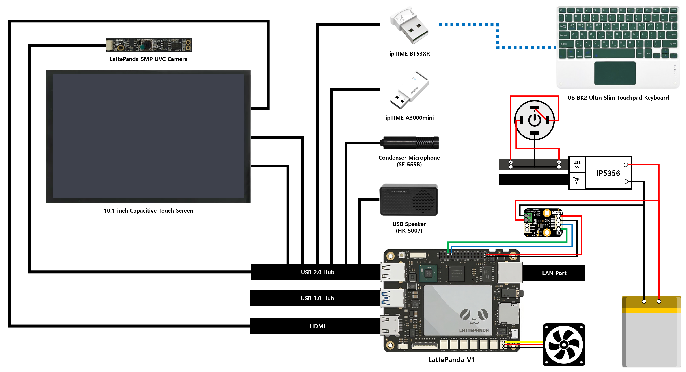

# 직접 만든 스타벅스 e-프리퀀시 노트북
<div align="center">
  <a href="https://www.youtube.com/watch?v=sObPySG9LdM">
    
  </a>
</div>

---

## 1. Hardware Information
- **Main Board:** LattePanda V1
    - **Processor:** Intel Atom x5-Z8350
    - **CPU Spec:** x86-64, 4-Core, 4-Thread, up to 1.92 GHz
    - **GPU Spec:** Intel HD Graphics 400, up to 500 MHz
    - **Memory:** 4GB LPDDR3
    - **Storage:** Onboard 64GB eMMC MicroSD Card Slot
    - **Co-Processor:** ATmega32u4 (Arduino Leonardo)
    - **Link:** [https://docs.lattepanda.com](https://docs.lattepanda.com)
- **Display:** 10.1-inch Capacitive Touch Screen (Yahboom)
    - **Resolution:** 1280x800 (Recommended), Up to 1920x1080 (Supported)
    - **Interface:** HDMI (Video), USB (Touch & Power)
- **Camera:** LattePanda 5MP UVC Camera
- **Audio**
    - **Speaker:** USB Speaker (HK-5007)
    - **Microphone:** Condenser Microphone (SF-555B)
- **Battery**
    - **Capacity:** 10000mAh (3.7V)
    - **Fuel Gauge:** Gravity 3.7V Li Battery Fuel Gauge SKU DFR0563
        - **Link:** [https://wiki.dfrobot.com/dfr0563](https://wiki.dfrobot.com/dfr0563)
    - **Management IC:** IP5356
- **Bluetooth Adapter:** ipTIME BT53XR (Bluetooth 5.3 USB Dongle / Dual Mode / Low Energy / Extended Range)
- **Wireless Network Adapter:** ipTIME A3000mini (IEEE 802.11ac 2Tx-2Rx 1200Mbps Wireless USB LAN card / Internal Antenna)
- **Keyboard:** UB BK2 Ultra Slim Touchpad Keyboard
- **Circuit Diagram**<br>
    


---


## 2. Software Information
- **Operating System:** Windows 10 Home (64-bit)
    - **Version:** 22H2 (OS Build 19045.6466)
    - **Download Link:** [https://www.microsoft.com/ko-kr/software-download/windows10](https://www.microsoft.com/ko-kr/software-download/windows10)
- **Language & Libraries**
    - 
        -    
    - 
        - 


---


## 3. Setup Instructions
### 3.1) Arduino Serial Port Configuration
- **Port:** `COM5`
- **Baud Rate:** `115200`

### 3.2) Install Libraries
- **Install Required Python Packages**
    ```bash
    pip install pyserial==3.5 pystray==0.19.5 Pillow==12.1.1 pyinstaller==6.19.0
    ```
    - **pyserial:** Python library that encapsulates access to the serial port
    - **pystray:** Library to create system tray application icons
    - **Pillow:** Python Imaging Library that adds image processing capabilities
    - **PyInstaller:** Library to convert Python applications into standalone executables

### 3.3) Build Executable
- **Build with PyInstaller**
    ```bash
    python -m PyInstaller --onefile --noconsole --name battery battery.py
    ```
    - `-m`: Runs PyInstaller as a Python module
    - `--onefile`: Creates a single executable file
    - `--noconsole`: Suppresses the console window when running the executable
    - `--name`: Specifies the name of the output file

### 3.4) Auto-start Application on Boot
- Move the project directory to `C:\Users\user\`
- Press `Win + R` to open the Run dialog
- Type `regedit` and press `Enter` to open the Registry Editor
- Navigate to `HKEY_CURRENT_USER\Software\Microsoft\Windows\CurrentVersion\Run`
- Right-click → **New** → **String Value**
- Set the value data to the full path of the executable, enclosed in quotes.
    - **Name:** `battery`
    - **Type:** `REG_SZ`
    - **Data:** `"C:\Users\user\starbucks-laptop\dist\battery.exe"`
    
### 3.5) LattePanda Auto Power-On
- Power on the LattePanda and repeatedly press `Del` to enter the BIOS menu
- Navigate to the **Boot** tab in the top menu
- Find **Machine Status AC/Battery In** and change the value to **Power On**
- Press `F4` to save and exit